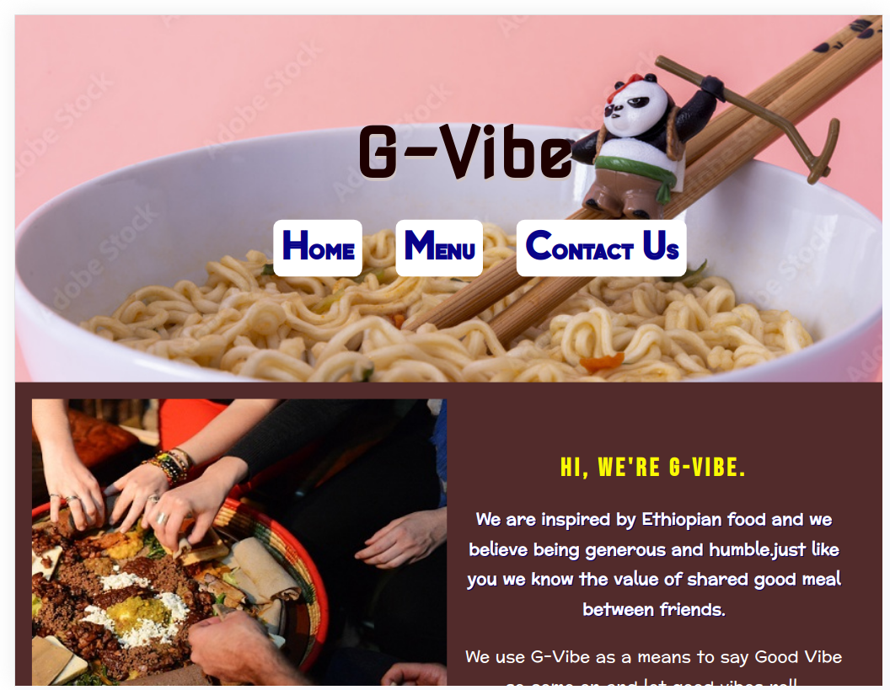
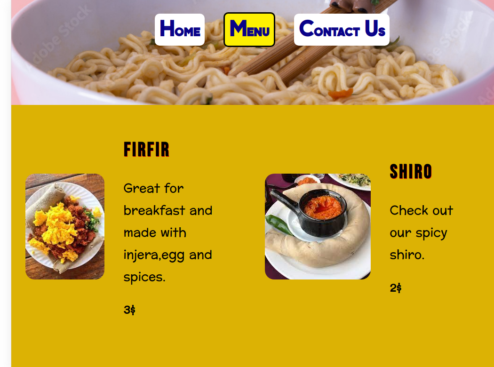

# restaurant_page
This project was solution for odin restaurant page [https://www.theodinproject.com/lessons/node-path-javascript-restaurant-page] to learn more about webpack and ES6 modules to organize projects.

# Built with
-html,css and js
# scrennshoot

# Live preview
[https://girma3.github.io/restaurant_page/]
# what I learned
to separate source and distribution file to make projects organize ,using webpack to build project,import and use modules,tab logic to change content on page.
# want to improve
using more webpack commands and htmlwebplugim to create template for html
# helpful materials
for gudies [https://webpack.js.org/],to understad ehy webpack or module nedded [https://peterxjang.com/blog/modern-javascript-explained-for-dinosaurs.html]
